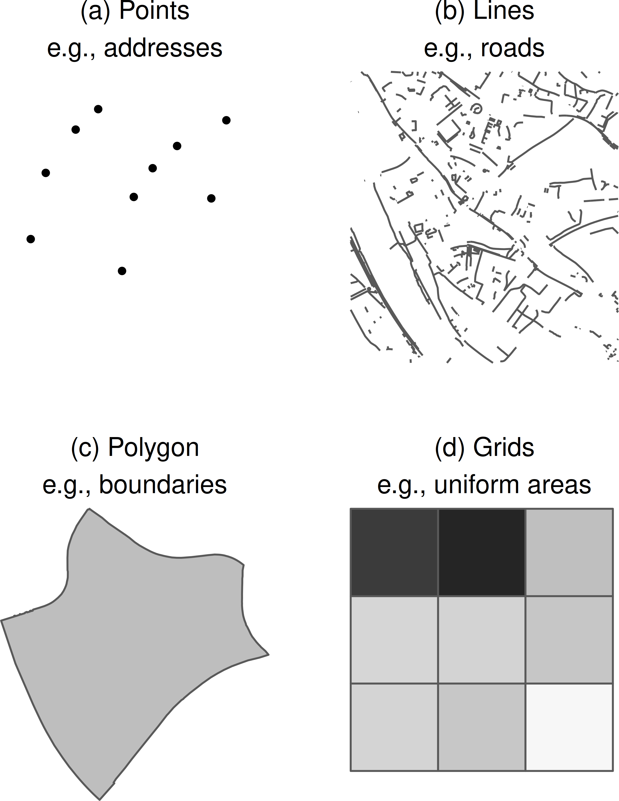
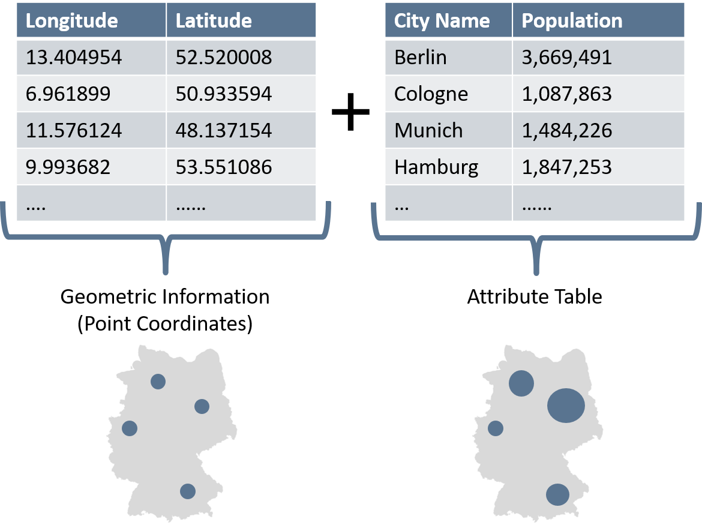
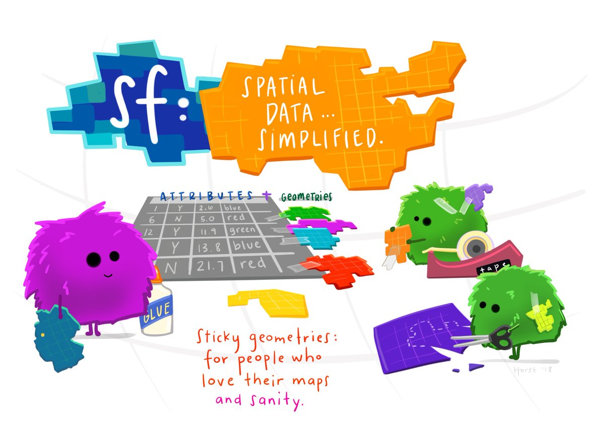
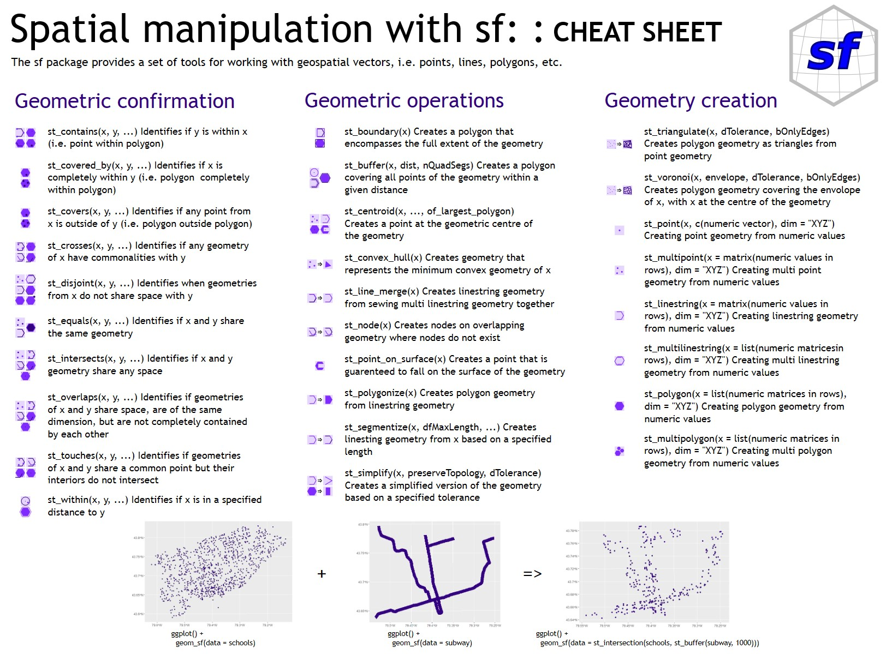
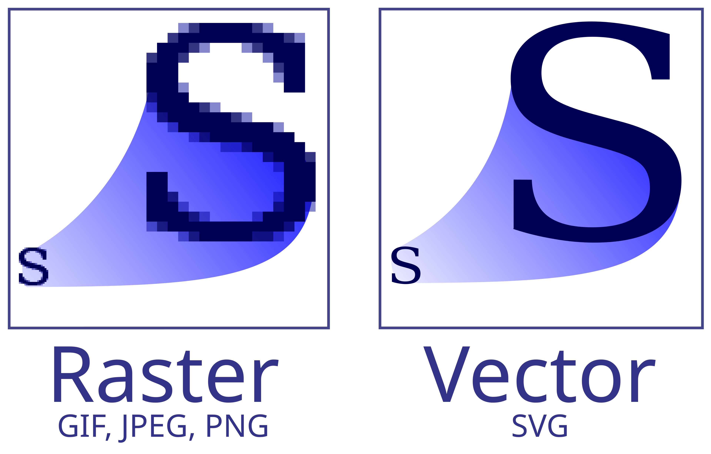
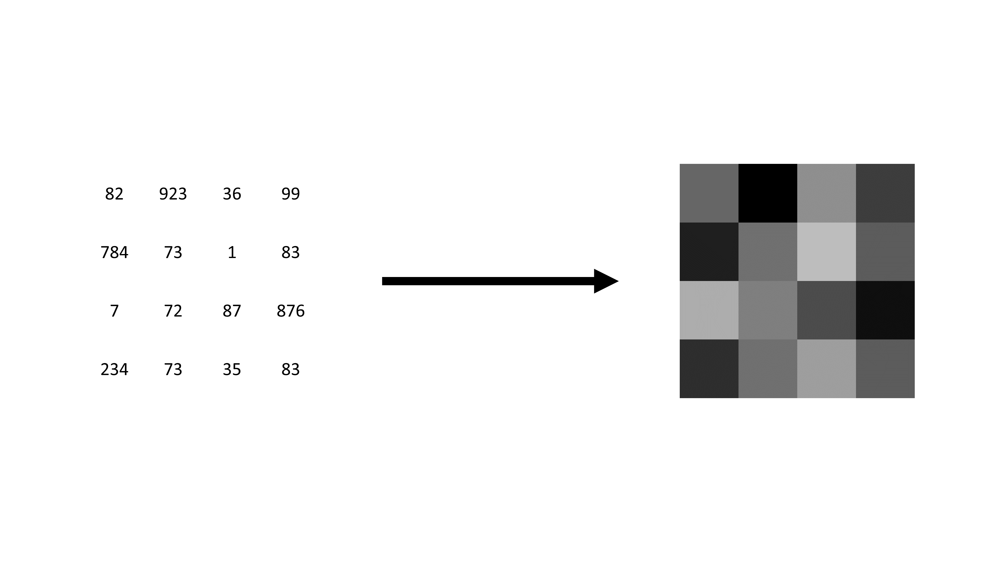
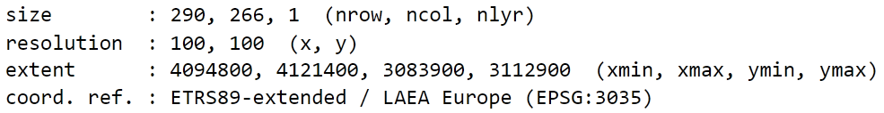

```{r}
#| include: false
library(dplyr)
library(sf)
library(terra)
library(tmap)
```


```{r}
#| echo: false
source("course_content.R") 

course_content |> 
  kableExtra::row_spec(3, background = "yellow")
```

## Refresher: geospatial data and their implementation in `R` {.center style="text-align: center;"}

## Why care about data types and formats?

There are differences in how spatial information is stored, processed, and visually represented.

- Different commands for data import and manipulation
- Spatial linking techniques and analyses partly determined by data format
- Visualization of data can vary

So, always know what kind of data you are dealing with!

## Vector and raster data

{.r-stretch fig-align="center"}

<small>Sources: OpenStreetMap / GEOFABRIK (2018), City of Cologne (2014), and the Statistical Offices of the Federation and the Länder (2016) / Jünger, 2019</small>

## Vector data {.center style="text-align: center;"}

## Representing the world in vectors

:::: columns
::: {.column width="50%"}
```{r}
#| echo: false
#| out.width: "120%"
library(tmap)
data(World, metro)

tm_shape(World) +
  tm_borders()+
  tm_shape(metro) +
  tm_dots()
```
:::

::: {.column width="50%"}
The surface of the earth is represented by simple geometries and attributes.

Each object is defined by longitude (x) and latitude (y) values.

It could also include z coordinates...
:::
::::

## Vector data: geometries

:::: columns
::: {.column width="50%"}
Every real-world feature is one of three types of geometry:

- Points: discrete location (e.g., a tree)
- Lines: linear feature (e.g., a river)
- Polygons: enclosed areas (e.g., a city, country, administrative boundaries)
:::

::: {.column width="50%"}
{fig-align="center" width="75%"}
<small>National Ecological Observatory Network (NEON), cited by [Datacarpentry](https://datacarpentry.org/organization-geospatial/instructor/02-intro-vector-data.html)</small>

:::
::::

## Vector data: attribute tables

Only geometries means that we do not have any other information.

We must assign attributes to each geometry to hold additional information $\rightarrow$ data tables called attribute tables.

- Each row represents a geometric object, which we can also call observation, feature, or case
- Each column holds an attribute or, in 'our' language, a variable

## Vector data: attribute tables

{.r-stretch fig-align="center"}

## File formats/extensions

- GeoPackage `.gpkg`
- Shapefile `.shp`
- GeoJSON `.geojson`
- ...
- Sometimes, vector data come even in a text format, such as `CSV`

## Welcome to `simple features`

:::: columns
::: {.column width="50%"}
Several packages are out there to wrangle and visualize spatial and, especially, vector data within `R`. We often use the `sf` package ("simple features"). But there is also an implementation in the `terra` package we use for our raster data.

<br>
Why? 

`simple features` refers to a formal standard representing spatial geometries and supports interfaces to other programming languages and GIS systems (ISO 19125-1).
:::

::: {.column width="50%"}

{fig-align="center"}

<p style="text-align: right;"><small>Illustration by [Allison Horst](https://allisonhorst.com/r-packages-functions)</small></p>
:::
::::

## Load a vector data file

The first step is, of course, loading the data. We want to import the `.geojson` file for the administrative borders of the whole world called `World_Countries.geojson`.

```{r}
#| include: false
# load library
library(sf)

# load data
# source: https://hub.arcgis.com/datasets/esri::world-countries-generalized/
hello_world <- sf::read_sf("../../data/World_Countries.geojson")
```

```{r}
#| eval: false
# load library
library(sf)

# load data
# source: https://hub.arcgis.com/datasets/esri::world-countries-generalized/
hello_world <- sf::read_sf("./data/World_Countries.geojson")
```

## We can already plot it

```{r}
plot(sf::st_geometry(hello_world)) # geometry only, no attributes
```

## This is the bounding box

The bounding box is the smallest rectangle enclosing all geometries — a key concept we'll use later for cropping raster data.

```{r}
#| echo: false
plot(sf::st_geometry(hello_world))
sf::st_bbox(hello_world) |> 
  sf::st_as_sfc(crs = sf::st_crs(hello_world)) |> 
  plot(add = TRUE)
```

## Inspect your data: classics

There are no huge differences between the file we just imported and a regular data table.

```{r}
# head of data table
head(hello_world, 2)
```

## Inspect your data: geometry type

Besides our general data inspection, we may also want to check the spatial features of our import. This check includes the geometric type (points? lines? polygons?) and the coordinate reference system.

```{r}
# type of geometry
sf::st_geometry(hello_world) 
```

## Inspect your data: multipolygons

Each polygon is defined by several connected points to build an enclosed area. Several polygons in one data frame have the `sf` type `multipolygons`. Just as the world consists of several states, the polygon of the world consists of several smaller polygons.

```{r}
attr(hello_world, "sf_column") |> # get geometry column name
  dplyr::pull(hello_world, var = _) |> # extract it
  dplyr::glimpse() # compact overview
```

## Inspect your data: CRS

Remember: The Coordinate Reference System is critical. A crucial step is to check the CRS of your geospatial data.

```{r}
# coordinate reference system
sf::st_crs(hello_world) 
```

## Spatial joins

Often, we want to combine geospatial datasets from different sources. The choice of an appropriate method depends, once again, on the data format. In the world of vector data, we usually speak of "spatial joins" when linking two vector datasets. Let's pull in more spatially narrowed data.

:::: columns
::: {.column width="50%"}
```{r}
#| eval: false
german_districts <-
  sf::st_read(
    "./data/VG250_KRS.shp",
    as_tibble = TRUE # returns tibble, not plain df
  )

plot(german_districts["AGS"]) # plot by district code
```

```{r}
#| message: false
#| warning: false
#| include: false
german_districts <-
  sf::st_read(
    "../../data/VG250_KRS.shp",
    as_tibble = TRUE
  )

plot(german_districts["AGS"])
```
:::

::: {.column width="50%"}
```{r}
#| echo: false
#| fig-asp: .7
plot(german_districts["AGS"])
```
:::
::::

## Spatial joins

Using the synthetic survey geocoordinates, we can craft a toy example to demonstrate spatial joins. This is how they look.

:::: columns
::: {.column width="50%"}
```{r}
#| eval: false
points <-
  readRDS(
    "./data/synthetic_survey_gecoordinates.rds"
  ) |>
  sf::st_transform(sf::st_crs(german_districts)) # match CRS

plot(sf::st_geometry(points)) # point locations
```
:::

::: {.column width="50%"}
```{r}
#| echo: false
#| fig-asp: .9
points <-
  readRDS(
    "../../data/synthetic_survey_geocoordinates.rds"
  ) |>
  sf::st_transform(sf::st_crs(german_districts)) # match CRS

plot(sf::st_geometry(points)) # point locations
```
:::
::::


## Spatial joins

It would be nice if we had regional identifiers in our points data, but there aren't any. This issue shows where spatial joins come in handy. We can use `sf::st_join()` to extract this information.

```{r}
points_ags <- sf::st_join(points, german_districts["AGS"]) # join by location

points_ags
```

## There's more

In this course, we only use a subset of the options for spatial joins in `sf`. Please refer to the official [sf cheat sheet](https://rstudio.github.io/cheatsheets/sf.pdf).

{.r-stretch fig-align="center"}

## Finally: Transforming the CRS

We have to change our CRS fairly often depending on our data sources. That's easily doable in `sf` using the `sf::st_transform()`. Here's a closer look.

```{r}
sf::st_crs(german_districts)$epsg # current CRS
```

Let's pretend we want to use the EPSG code `4326`--no problem!

```{r}
german_districts_4326 <- sf::st_transform(german_districts, 4326) # reproject

sf::st_crs(german_districts_4326)$epsg # verify new CRS
```

## Exercise 2_1: Vector Data Refresher

{width="45%" fig-align="center"}

## Raster data {.center style="text-align: center;"}

Now that we've refreshed vector data, let's look at the other major spatial data format. While vector data represent discrete features (points, lines, polygons), raster data represent continuous surfaces as a grid of cells.

## Difference to vector data

::::: columns
::: {.column width="50%"}
-   Other data format(s), different file extensions
-   Geometries do not differ within one dataset
-   Other geospatial operations possible
-   Can be way more efficient and straightforward to process
-   It's like working with simple tabular data
:::

::: {.column width="50%"}

<p style="text-align: right;">

<small>Von Yug, modifications by Cfaerber et al. - Eigenes Werk, CC BY-SA 2.5, https://commons.wikimedia.org/w/index.php?curid=1183592</small>
</p>
:::
:::::

## Visual difference between vector and raster data

Remember this figure from earlier? Now let's focus on the right side — the raster representation.

{.r-stretch fig-align="center"}


## What exactly are raster data?

- Hold information on (most of the time) evenly shaped grid cells
- Basically, a simple data table
- Each cell represents one observation

{.r-stretch fig-align="center"}

## Metadata

::::: columns
::: {.column width="50%"}
-   Information about geometries is globally stored
-   They are the same for all observations
-   Their location in space is defined by their cell location in the data table
-   Without this information, raster data would be simple image files
:::

::: {.column width="50%"}
{fig-align="right" width="75%"}
<p style="text-align: center;">
<small>https://knowyourmeme.com/memes/theyre-the-same-picture</small>
</p>
:::
:::::

## Important metadata

**Raster Dimensions** $\rightarrow$  number of columns, rows, and cells

**Extent** $\rightarrow$ similar to bounding box in vector data

**Resolution** $\rightarrow$ the size of each raster cell

**Coordinate reference system** $\rightarrow$ defines where on the earth's surface the raster layer lies

{.r-stretch fig-align="center"}


## Setting up a raster dataset is easy

```{r}
input_data <- matrix(sample(1:100, 16), nrow = 4) # 4x4 random values

raster_layer <- terra::rast(input_data) # matrix → raster

raster_layer
```

## We can already plot it

This toy example shows: a raster is just a matrix with spatial metadata. The real power comes when we load actual geodata.

```{r}
terra::plot(raster_layer)
```

## File formats/extensions

- GeoTIFF `tif`
- Gridded data `.grd`
- Network common data format `.nc`
- Esri grid `.asc`
- ...
- Sometimes, raster data come even in a text format, such as `CSV`

## Implementations in `R`

`terra` is the most commonly used package for raster data in `R`.

Some other developments, e.g., in the `stars` package, also implement an interface to simple features in `sf`. We will work with `stars` later in this course.

The `terra` package helps to employ zonal statistics. But the `spatstat` package is even more elaborated.

## Loading raster tiffs (German Census Data 2022)

The `./data/z22/` folder contains 1 km² grid data from the German Census 2022, gathered via the [`z22` R package](https://github.com/JsLth/z22) (available on [CRAN](https://cran.r-project.org/package=z22)). Single variables are stored as `.tif`, categorical variables with multiple groups as `.nc`.

::: {.callout-tip}
## Looking up Census variable names

File names correspond to Census features (e.g., `population.tif`, `rent_avg.tif`). For descriptions, you have two options:

1. **In R** (if `z22` is installed): `z22::z22_features()` lists all available features; `z22::z22_categories("age_short")` decodes the layers inside `.nc` files.
2. **Online**: Browse the [Census 2022 database](https://ergebnisse.zensus2022.de/datenbank/online/themes) for full variable documentation.
:::

Loading raster data in `terra` is straightforward. For this purpose, we use the function `terra::rast()`.

```{r}
#| eval: false
pop_grid_ger_2022 <- terra::rast("./data/z22/population.tif") # load raster

pop_grid_ger_2022 # inspect metadata
```

```{r}
#| echo: false
pop_grid_ger_2022 <- terra::rast("../../data/z22/population.tif")

pop_grid_ger_2022
```

## Loading raster tiffs (German Census Data 2022)

Let's load another dataset to compare structures because that's really easy in `terra`.

```{r}
#| eval: false
age_under_18_grid_2022 <- terra::rast("./data/z22/age_under_18.tif") # % under 18

age_under_18_grid_2022 # compare metadata with population
```

```{r}
#| echo: false
age_under_18_grid_2022 <- terra::rast("../../data/z22/age_under_18.tif")

age_under_18_grid_2022
```

## Compare layers by plotting

:::: columns
::: {.column width="50%"}
```{r}
#| fig.asp: .7
terra::plot(
  pop_grid_ger_2022
)
```
:::

::: {.column width="50%"}
```{r}
#| fig.asp: .7
terra::plot(
  age_under_18_grid_2022
)
```
:::
::::

## Working with raster values

Working with raster data is straightforward — quite speedy, yet not as comfortable as working with `sf` objects.

`terra::global()` computes summary statistics efficiently (without loading all values into memory):

```{r}
terra::global(pop_grid_ger_2022, fun = "mean", na.rm = TRUE) # efficient summary
```

For custom statistics, extract the raw values as a vector with `terra::values()`:

```{r}
all_raster_values <- terra::values(pop_grid_ger_2022) # all cells as vector
mean(all_raster_values, na.rm = TRUE) # same result, more flexible
```

For large rasters, prefer `terra::global()` — it's faster and memory-friendly.

## Combining raster layers to calculate new values

Although raster data are simple data tables, working with them is a bit different compared to, e.g., simple features. We can combine raster layers using basic math. Here, we multiply population counts by the share of under-18s to get the absolute number of young people per cell.

:::: columns
::: {.column width="50%"}
```{r}
young_people <-
  pop_grid_ger_2022 * # population count
  (age_under_18_grid_2022 / 100) # × share under 18

young_people
```
:::

::: {.column width="50%"}
```{r}
#| echo: false
#| fig.asp: .6
terra::plot(young_people)
```
:::
::::

## Loading raster data with `stars`

Later, we will work with multidimensional raster data cubes. While it is possible to work them in `terra`, `stars` is way more elaborated (we'll discuss it tomorrow in more detail). So, here is an example of how to load raster data into `stars`.

```{r}
#| eval: false
pop_grid_ger_2022_stars <-
  stars::read_stars("./data/z22/population.tif") # same data, different package

pop_grid_ger_2022_stars # note the different output format
```

```{r}
#| echo: false
pop_grid_ger_2022_stars <-
  stars::read_stars("../../data/z22/population.tif")

pop_grid_ger_2022_stars
```

## `stars` objects can also be plotted

:::: columns
::: {.column width="50%"}
```{r}
#| eval: false
#| fig.asp: 1
plot(pop_grid_ger_2022_stars)
```
:::

::: {.column width="50%"}
```{r}
#| echo: false
#| fig.asp: 1
plot(pop_grid_ger_2022_stars)
```
:::
::::

## Finally: Transforming the CRS

As mentioned before, we may also have to change the CRS of our raster data. Returning to `terra`, this is not called 'transforming' but 'projecting' (which makes sense, right?).

```{r}
terra::crs(pop_grid_ger_2022, describe = TRUE)$code # current CRS
```

Let's pretend we want to use the EPSG code `3035`--no problem!

```{r}
pop_grid_ger_2022_3035 <- terra::project(pop_grid_ger_2022, "EPSG:3035") # reproject

terra::crs(pop_grid_ger_2022_3035, describe = TRUE)$code # verify new CRS
```

## Exercise 2_2: Basic Raster Operations

{width="45%" fig-align="center"}