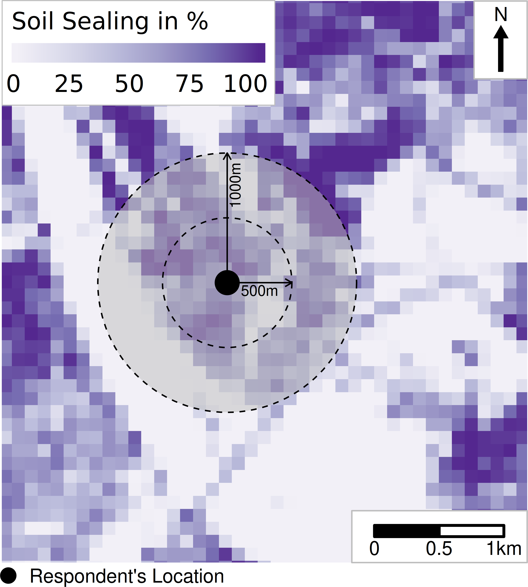
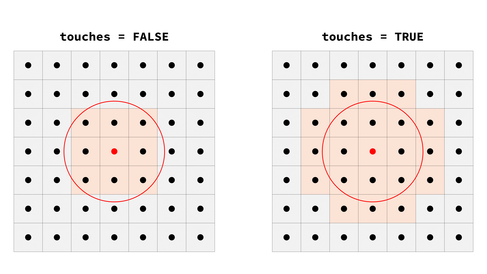
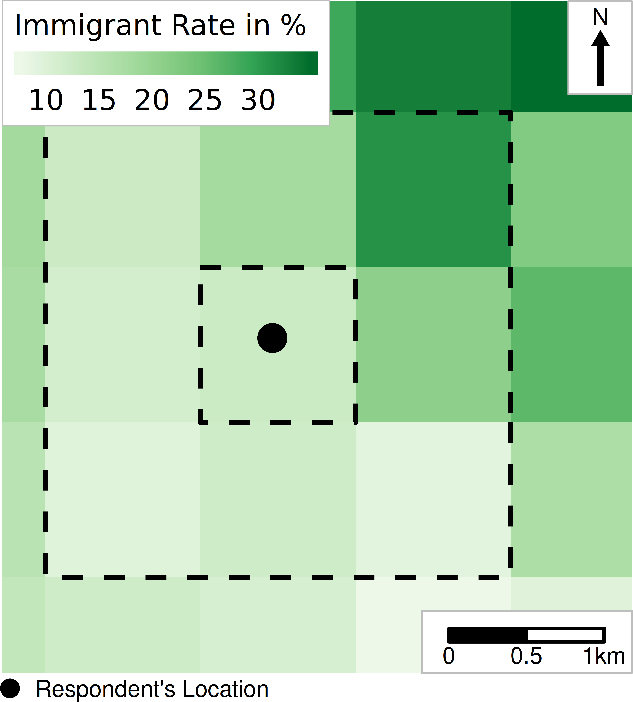
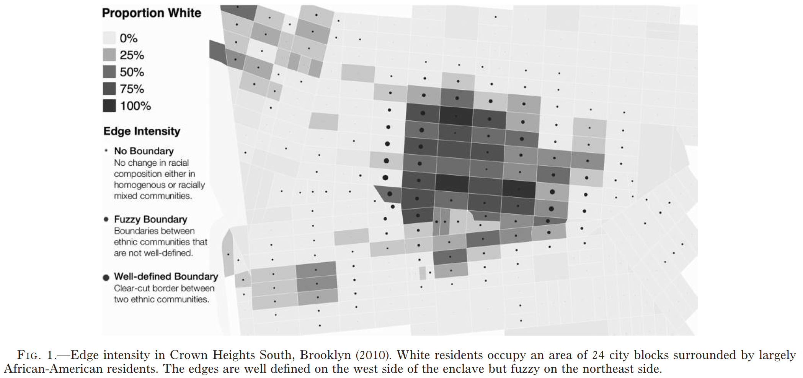

```{r}
#| include: false
library(dplyr)
library(sf)
library(terra)
library(tmap)
```

## Now

```{r}
#| echo: false
source("_ignore/sessions/course_content.R") 

course_content |> 
  kableExtra::row_spec(5, background = "yellow")
```

## Our plan

Thus far, we have learned about

- Different data formats
- How to load them
- First steps in interacting with them

In this session, you will learn

- How to wrangle raster data even further
- Linking to vector data
- Manipulating the raster values
- How to convert from one format into the other

## Quick reminder: Census data documentation

We'll continue using Census 2022 rasters from `./data/z22/` throughout this session. If you're unsure what a variable represents:

- **In R**: `z22::z22_features()` lists all features; `z22::z22_categories()` decodes `.nc` layer names
- **Online**: [Census 2022 database](https://ergebnisse.zensus2022.de/datenbank/online/themes)

The data were downloaded with the [`z22` package](https://cran.r-project.org/package=z22) — see `R/download_z22.R` in the course repo for the exact script.

## Subsetting {.center style="text-align: center;"}

## Cropping raster data

Cropping is a method of cutting out a specific 'slice' of a raster layer based on an input dataset or geospatial extent, such as a bounding box. We often do this to 'zoom' in on a dataset or to make our computations more efficient. Let's pretend we are mainly interested in the small-scale population size of Eastern Germany. For this purpose, we can use the bounding box of Eastern Germany.

## Bounding box in `R`

The easiest way (in my opinion) to create a bounding box in `R` is to use the `sf::st_bbox()` function, possibly based on another geospatial dataset.

```{r}
#| output-location: fragment
bbox_east <-
  sf::st_read("./data/boundaries/VG250_LAN.shp") |>
  dplyr::filter(SN_L %in% 11:16, GF == 4) |> # Eastern states
  sf::st_transform(3035) |> # reproject
  sf::st_bbox() |> # bounding box
  sf::st_as_sfc(crs = 3035) # as geometry

bbox_east
```

## Cropping the Census data on population numbers

Now, cropping is easy using the `terra::crop()` function.

```{r}
#| output-location: fragment
pop_grid_2022 <- terra::rast("./data/z22/population.tif")

pop_grid_2022_crop <- terra::crop(pop_grid_2022, bbox_east) # crop to bbox

terra::ext(pop_grid_2022) # full extent
terra::ext(pop_grid_2022_crop) # cropped extent
```

Note the different spatial extents.

## Plotting the different extents

:::: columns
::: {.column width="50%"}
```{r}
#| fig.asp: .8
terra::plot(pop_grid_2022)
```
:::

::: {.column width="50%"}
```{r}
#| fig.asp: .8
terra::plot(pop_grid_2022_crop)
```
:::
::::

## Wait a minute...

...do these data only include Eastern German states? Let's have a look at their shapes.

:::: columns
::: {.column width="50%"}
```{r}
#| eval: false
#| message: false
#| warning: false
#| fig-asp: .8
east_german_states <-
  sf::st_read(
    "./data/boundaries/VG250_LAN.shp",
    quiet = TRUE
  ) |>
  sf::st_transform(3035) |> 
  dplyr::filter(SN_L %in% 11:16, GF == 4) # subset

plot(pop_grid_2022_crop) # raster base layer
plot(
  sf::st_geometry(east_german_states),
  border = "white",
  col = scales::alpha("white", .2),
  lwd = 4,
  add = TRUE # overlay borders
)
```
:::

::: {.column width="50%"}
```{r}
#| echo: false
#| message: false
#| warning: false
#| fig-asp: .8
east_german_states <-
  sf::st_read(
    "./data/boundaries/VG250_LAN.shp",
    quiet = TRUE
  ) |>
  sf::st_transform(3035) |> 
  dplyr::filter(SN_L %in% 11:16, GF == 4) # subset 

plot(pop_grid_2022_crop) # raster base layer
plot(
  sf::st_geometry(east_german_states),
  border = "black",
  col = scales::alpha("white", .2),
  lwd = 4,
  add = TRUE # overlay borders
)
```
:::
::::

## First solution: `terra::mask()`

Masking is similar to cropping, yet values outside the masking geometry (rather than outside the extent) are set to missing values (`NA`) — the raster extent itself stays unchanged.

```{r}
#| echo: true
#| output-location: column-fragment
#| fig.asp: .8
pop_grid_2022_mask <-
  terra::mask(
    pop_grid_2022,
    terra::vect(east_german_states) # mask boundary
  )

plot(pop_grid_2022_mask)
```

::: {.callout-note}
Raster data often contain `NA` cells (e.g., water bodies, areas outside borders). Most functions require `na.rm = TRUE` to handle them — you'll see this argument throughout this session. Keep it in mind whenever you work with raster data!
:::

## Second and best solution: combining masking and cropping

```{r}
#| echo: true
#| output-location: column-fragment
#| fig.asp: .8
pop_grid_2022_crop <-
  terra::mask(
    pop_grid_2022,
    terra::vect(east_german_states) # mask boundary
  ) |>
  terra::crop(east_german_states) # trim extent

plot(pop_grid_2022_crop)
```

## Exercise 3_1: Subsetting Raster Data

{width="45%" fig-align="center"}

## Extraction & Aggregation {.center style="text-align: center;"}

## Changes in terminology

If we only want to add one attribute from a vector dataset `Y` to another vector dataset `X`, we can conduct a spatial join using `sf::st_join()` as shown earlier. In the raster data world, these operations are called raster extractions.

Raster data are helpful when we aim to

- Apply calculations that are the same for all geometries in the dataset
- **Extract information from the raster fast and efficiently**

## Pulling in some data

For this effort, we re-import the synthetic survey geocoordinates. We sample 100 geocoordinates from the whole dataset, as we only need a few to demonstrate the procedures that are followed.

```{r}
#| echo: true
#| output-location: column-fragment
points <-
  readRDS(
    "./data/survey/synthetic_survey_geocoordinates.rds"
  ) |>
  dplyr::sample_n(size = 100) # random subset

points
```

## Raster extraction

We use the following to extract the raster values at a specific point by location.

```{r}
#| output-location: fragment
terra::extract(pop_grid_2022, points, ID = FALSE) |> # extract at point locations
  head(10)
```

::: {.callout-warning}
Make sure your raster and vector data share the same CRS before extracting — `terra::extract()` will not always warn you if they don't, and results may be silently wrong!
:::

## Add results to existing dataset

This information can be added to an existing dataset (our points in this example).

```{r}
#| output-location: fragment
points$pop <- # add as new column
  terra::extract(pop_grid_2022, points, ID = FALSE)[[1]]

points
```

## More elaborate: spatial buffers

Sometimes, extracting information 1:1 is not enough.

- It's too narrow
- There is missing information about the surroundings of a point

{.r-stretch fig-align="center"}

## Buffer extraction

We can use spatial buffers of different sizes to extract information about our surroundings.

:::: columns
::: {.column width="50%"}
```{r}
#| code-line-numbers: "3"
terra::extract(
  pop_grid_2022,
  sf::st_buffer(points, 2500), # 2.5km buffer
  fun = mean,
  na.rm = TRUE,
  ID = FALSE,
  raw = TRUE
) |>
  head(10)
```
:::

::: {.column width="50%"}
```{r}
#| code-line-numbers: "3"
terra::extract(
  pop_grid_2022,
  sf::st_buffer(points, 5000), # 5km buffer
  fun = mean,
  na.rm = TRUE,
  ID = FALSE,
  raw = TRUE
) |>
  head(10)
```
:::
::::

## Extraction toggles: `touches`

There's a multitude of arguments that we can adjust to conduct the extraction. An important option is from which raster cells we want our extraction done. Here's an example of how the argument `terra::extract(..., touches = FALSE/TRUE)` works.

{.r-stretch fig-align="center"}

## `touches = FALSE` vs. `touches = TRUE`

Let's see how the values differ when we apply the option or not.

:::: columns
::: {.column width="50%"}
```{r}
#| code-line-numbers: "6"
terra::extract(
  pop_grid_2022,
  sf::st_buffer(points, 2500),
  fun = mean,
  na.rm = TRUE,
  touches = FALSE, # strict: cells inside only
  ID = FALSE,
  raw = TRUE
) |>
  head(10)
```
:::

::: {.column width="50%"}
```{r}
#| code-line-numbers: "6"
terra::extract(
  pop_grid_2022,
  sf::st_buffer(points, 2500),
  fun = mean,
  na.rm = TRUE,
  touches = TRUE, # also touching cells
  ID = FALSE,
  raw = TRUE
) |>
  head(10)
```
:::
::::

## Extraction function

Often, we default to the mean of raster cell values to be extracted. In our example, calculating the sum is more relevant as we deal with population counts. Or the maximum?

:::: columns
::: {.column width="50%"}
```{r}
#| code-line-numbers: "4"
terra::extract(
  pop_grid_2022,
  sf::st_buffer(points, 2500),
  fun = sum, # total population
  na.rm = TRUE,
  touches = FALSE,
  ID = FALSE,
  raw = TRUE
) |>
  head(10)
```
:::

::: {.column width="50%"}
```{r}
#| code-line-numbers: "4"
terra::extract(
  pop_grid_2022,
  sf::st_buffer(points, 2500),
  fun = max, # peak population
  na.rm = TRUE,
  touches = TRUE,
  ID = FALSE,
  raw = TRUE
) |>
  head(10)
```
:::
::::

## Custom functions

We can even define custom functions.

```{r}
#| output-location: fragment
#| code-line-numbers: "4"
terra::extract(
  pop_grid_2022,
  sf::st_buffer(points, 2500),
  fun = function (x) {max(x, na.rm = TRUE) / sum(x, na.rm = TRUE)}, # max/sum ratio
  touches = FALSE,
  ID = FALSE,
  raw = TRUE
) |>
  head(10)
```

## Raster aggregation

We can use the same procedure to aggregate a raster dataset into a vector polygon dataset. That's a widespread use case. Let's load our German districts vector dataset in `./data/boundaries/`. This time, we will use WorldPop raster data on gender ratios from 2020.

```{r}
#| echo: true
#| output-location: column-fragment
#| fig.asp: .8
german_districts <-
  sf::st_read(
    "./data/boundaries/VG250_KRS.shp",
    quiet = TRUE
  ) |>
  sf::st_transform(3035) # match raster CRS

gender_ratios_2020 <-
  terra::rast("./data/worldpop/gender_ratio_2020.tif")

plot(gender_ratios_2020) # raster base layer
plot(
  sf::st_geometry(german_districts),
  border = "white", col = NA,
  lwd = .5, add = TRUE # overlay districts
)
```

## Adding the aggregated data

Again, we use `terra::extract()` to create the aggregated data, which we can add to our vector dataset.

```{r}
#| echo: true
#| output-location: column-fragment
#| fig.asp: .8
german_districts$gender_ratios_2020 <-
  terra::extract(
    gender_ratios_2020,
    german_districts, # aggregate into polygons
    fun = mean,
    na.rm = TRUE,
    ID = FALSE
  ) |>
  unlist() # extract returns df → vector

plot(german_districts["gender_ratios_2020"])
```

## Manipulating the raster data {.center style="text-align: center;"}

## Digging deeper

The previous steps are efforts that work on the raw raster cell values data. However, there are occasions where we might want to work on the raster data themselves or pre-process them to add them to another dataset (e.g., a vector file). Some of these procedures are for visualization, such as heat maps, and others are necessary for our later analyses. We will show a few in the following.

## Creating a quick 'heat map'

Population counts for the whole of Germany help us to identify urban and rural clusters. But there may be applications where we need to zoom in on a specific city to identify within-city variations regarding specific attributes like average rent levels. Let's do that for the German capital Berlin. For this purpose, we subset the district data and mask and crop data on average rent prices from the German census.

```{r}
#| echo: true
#| output-location: column-fragment
#| fig.asp: .7
berlin <-
  german_districts |>
  dplyr::filter(AGS == "11000") # Berlin district

rent_berlin <-
  terra::rast("./data/z22/rent_avg.tif") |>
  terra::project("EPSG:3035") |> # reproject
  terra::mask(terra::vect(berlin)) |> # clip to Berlin
  terra::crop(berlin) # trim extent

plot(rent_berlin)
```

## It's easy

Although we can identify some clusters using the raw data, some smoothing may be helpful. We can use the `terra::focal()` function to do that. It applies a moving window filter on all raster cells of a grid. We'll have a more detailed look at this function in a minute.

```{r}
#| echo: true
#| output-location: column-fragment
#| fig.asp: .7
rent_berlin_smooth <-
  terra::focal(
    rent_berlin,
    w = matrix(1, 5, 5), # 5x5 moving window
    fun = mean,
    na.rm = TRUE
  )

plot(rent_berlin_smooth)
```

## 'Real' point pattern analysis

So far, we used grid-cell-level Census data for our heat map. But what if we only have point observations, e.g., from a survey? We can create a similar density surface from scratch using `terra::rasterize()`. Let's demonstrate this with the synthetic survey coordinates.

Usually, when we talk about heat maps, we mean analyzing point patterns and whether they spatially cluster. `terra` might not be your best choice regarding more elaborate techniques to estimate density kernels and distance-based bandwidths between points to draw clusters. For this purpose, packages such as `spatstat` are better suited but require [learning about other data structures](https://r-spatial.org/book/11-PointPattern.html). That said, densities are more advanced ways of counting things in raster grid cells, and we can mimic this behavior also with `terra`. So, let's stick to this package and crop all of our points to the extent of Berlin.

```{r}
#| echo: true
#| output-location: column-fragment
#| fig.asp: .5
points_berlin <-
  readRDS(
    "./data/survey/synthetic_survey_geocoordinates.rds"
  ) |>
  sf::st_crop(berlin) # subset to Berlin

plot(sf::st_geometry(points_berlin)) # point locations
```

## Creating a raster density template

Next, we simply want to count survey respondent locations in raster grid cells for our density estimation. However, our points are sparse compared to our comprehensive raster dataset. We cannot initially rely on 1 km² grid cells as with the Census grid data. But a 5 km resolution may be a good compromise. Let's do that!

```{r}
#| output-location: fragment
raster_template <-
  points_berlin |>
  sf::st_bbox() |> # extent of points
  terra::ext() |> # as terra extent
  terra::rast(resolution = 5000, crs = "EPSG:3035") # 5km grid

raster_template
```

## Rasterize: counting points in grid cells

You may wonder why we are doing that. The answer is simple: We want to count the number of points in each grid cell. We use the function `terra::rasterize()` as a simple technique.

```{r}
#| echo: true
#| output-location: column-fragment
#| fig.asp: .8
points_berlin_density <-
  terra::rasterize(
    points_berlin,
    raster_template, # target grid
    fun = "sum", # count per cell
    background = 0 # empty cells = 0
  )

plot(points_berlin_density)
```

## Reproject to a finer grid

Now, this is not very pleasant. These data look... not good. But fear not, working with raster data is powerful, as we now use a function you already know for projecting one CRS into another: `terra::project()`. This function can also be used to aggregate and disaggregate data based on the structure of another dataset. So, while we could not initially use 1 km² grid cells for our density 'estimation', we can reproject our 5 km² onto a 1 km² grid like our Census grid data. A bit of masking also helps get rid of cells that are not within the Berlin border.

```{r}
#| echo: true
#| output-location: column-fragment
#| fig.asp: .55
points_berlin_density <-
  points_berlin_density |>
  terra::project(rent_berlin) |> # match 1km grid
  terra::mask(rent_berlin) # clip to Berlin

plot(points_berlin_density)
```

## Smoothing: 5×5 window

We can also apply smoothing as with the population grid data.

:::: columns
::: {.column width="50%"}
```{r}
#| fig.asp: .6
terra::focal(
  rent_berlin,
  w = matrix(1, 5, 5),
  fun = mean,
  na.rm = TRUE
) |>
  plot()
```
:::

::: {.column width="50%"}
```{r}
#| fig.asp: .6
focal(
  points_berlin_density, 
  w = matrix(1, 5, 5), 
  fun = mean,
  na.rm = TRUE
) |> 
  plot()
```
:::
::::


## Smoothing: 3×3 window

We can adjust the smoothing to a smaller degree.

:::: columns
::: {.column width="50%"}
```{r}
#| fig.asp: .7
terra::focal(
  rent_berlin,
  w = matrix(1, 3, 3),
  fun = mean,
  na.rm = TRUE
) |>
  plot()
```
:::

::: {.column width="50%"}
```{r}
#| fig.asp: .7 
focal(
  points_berlin_density, 
  w = matrix(1, 3, 3), 
  fun = mean,
  na.rm = TRUE
) |> 
  plot()
```
:::
::::

## Smoothing: 9×9 window

We can also adjust the smoothing to a higher degree.

:::: columns
::: {.column width="50%"}
```{r}
#| fig.asp: .7
terra::focal(
  rent_berlin,
  w = matrix(1, 9, 9),
  fun = mean,
  na.rm = TRUE
) |>
  plot()
```
:::

::: {.column width="50%"}
```{r}
#| fig.asp: .7 
focal(
  points_berlin_density, 
  w = matrix(1, 9, 9), 
  fun = mean,
  na.rm = TRUE
) |> 
  plot()
```
:::
::::

Larger windows produce smoother surfaces but lose local detail — choose based on your research question.

## What is this argument `w`?

It's magic. Just kidding, but it is indeed really powerful. It builds around the idea of connecting the value of a focal grid cell to the values of surrounding grid cells, as in the figure below. Hence, the name of the function `terra::focal()` where the argument is used.

{.r-stretch fig-align="center"}

## It's just a simple base `R` matrix

When using this matrix as input and applying the statistic `fun = mean`, we change the value of the focal grid cell to the mean of the values of itself and the 24 surrounding grid cells.

```{r}
#| output-location: fragment
matrix(1, 5, 5)
```

::: {.fragment}
But we can change that however we want:

```{r}
#| output-location: fragment
weighted_w <- matrix(c(rep(.5, 12), 1, rep(.5, 12)), 5, 5) # center weighted

weighted_w
```
:::

## Applying it to the rent grid data

:::: columns
::: {.column width="50%"}
```{r}
#| fig.asp: .7
terra::focal(
  rent_berlin,
  w = matrix(1, 5, 5),
  fun = mean,
  na.rm = TRUE
) |>
  plot()
```
:::

::: {.column width="50%"}
```{r}
#| fig.asp: .7
focal(
  rent_berlin,
  w = weighted_w,
  fun = mean,
  na.rm = TRUE
) |>
  plot()
```
:::
::::

## Real life example: Detecting spatial boundaries

Edge detection algorithms from image processing can be applied to raster data to identify sudden spatial changes. For instance, Legewie & Schaeffer (2016) used this technique to study ethnic neighborhood boundaries. We can apply the same idea to detect rent price boundaries — areas where average rents change abruptly, which may indicate gentrification fronts or distinct housing submarkets.

{.r-stretch fig-align="center"}

##  What is edge detection?

Edge detection identifies sudden color changes in an image to 'draw' borders of things in a picture. Here's an example of the prominent Sobel filter.

:::: columns
::: {.column width="50%"}
{fig-align="center" width="75%"}
:::

::: {.column width="50%"}
{fig-align="center" width="75%"}
:::
::::

<small>Source: [Wikipedia — Sobel operator](https://en.wikipedia.org/wiki/Sobel_operator)</small>

## We can do that as well using a Sobel filter

`R` is good for math, right? While this is the formula for applying the Sobel filter to a raster image...

$$r_x = \begin{bmatrix}1 & 0 & -1 \\2 & 0 & -2 \\1 & 0 & -1\end{bmatrix} \times raster\_file \\r_y = \begin{bmatrix}1 & 2 & 1 \\0 & 0 & 0 \\-1 & -2 & -1\end{bmatrix}\times raster\_file \\r_{xy} = \sqrt{r_{x}^2 + r_{y}^2}$$


## Implementation in R

...we can easily translate it to be used in `terra::focal()`^[http://search.r-project.org/R/library/terra/html/focal.html].

```{r}
sobel <- function(r) {
  fy <- matrix(c(1, 0, -1, 2, 0, -2, 1, 0, -1), nrow = 3) # vertical kernel
  fx <- matrix(c(-1, -2, -1, 0, 0, 0, 1, 2, 1) , nrow = 3) # horizontal kernel (sign-flipped vs. formula — doesn't matter since we square it)
  rx <- terra::focal(r, fx) # horizontal gradient
  ry <- terra::focal(r, fy) # vertical gradient
  sqrt(rx^2 + ry^2) # gradient magnitude
}

rent_berlin_edges <- sobel(rent_berlin_smooth) # apply to smoothed rents
```

## Comparison

We can now clearly display the edges of sudden changes in rent levels within Berlin.

```{r}
#| output-location: fragment
#| layout-ncol: 2
#| fig.asp: .6
plot(rent_berlin_smooth)
plot(rent_berlin_edges)
```

## Exercise 3_2: Extracting and Analyzing Raster Information

{width="45%" fig-align="center"}

## Conversion {.center style="text-align: center;"}

## Why convert?

Sometimes we need to switch between raster and vector representations:

- **Raster → Points**: When you need to treat grid cells as individual observations for statistical analysis
- **Points → Raster**: When you want to create a continuous surface from point measurements
- **Raster → Polygons**: When you need to join raster information into a vector-based workflow (e.g., for spatial joins with `sf`)

All conversions are straightforward with `terra`.

## Raster to points

```{r}
#| echo: true
#| output-location: column-fragment
#| fig.asp: 1
raster_now_points <-
  rent_berlin |>
  terra::as.points() # each cell → point

plot(raster_now_points)
```

## Points to raster

```{r}
#| echo: true
#| output-location: column-fragment
#| fig.asp: 1
raster_target_layer <-
  terra::ext(raster_now_points) |>
  terra::rast(res = 1000) # empty 1km target grid

points_now_raster <-
  raster_now_points |>
  terra::rasterize(
    raster_target_layer,
    field = "cat_0", # value column
    fun = "mean",
    background = 0
  )

plot(points_now_raster)
```

## Raster to polygons

```{r}
#| echo: true
#| output-location: column-fragment
#| fig.asp: 1
polygon_raster <-
  rent_berlin |>
  terra::as.polygons() |> # each cell → polygon
  sf::st_as_sf() # convert to sf

plot(polygon_raster)
```
