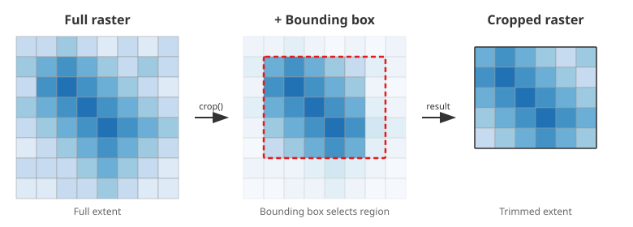
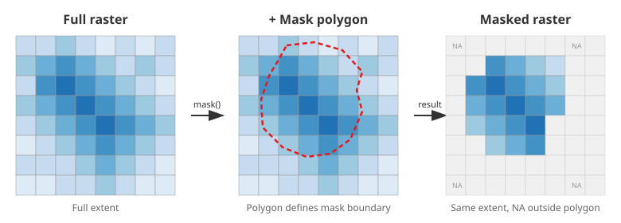
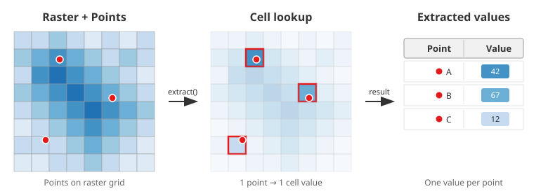
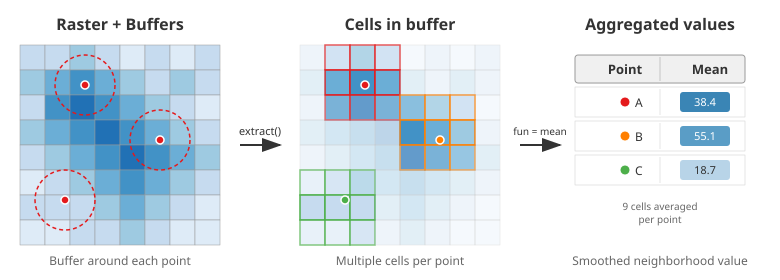
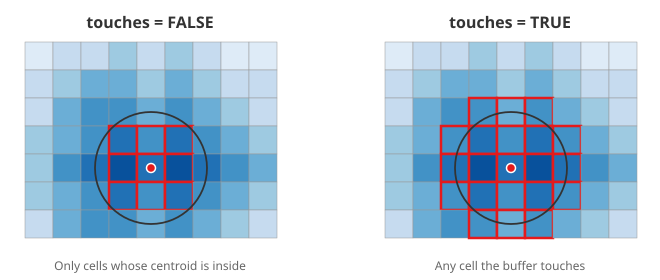
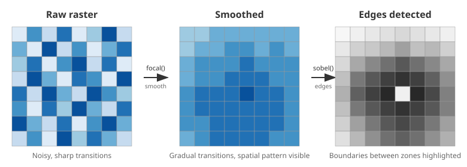
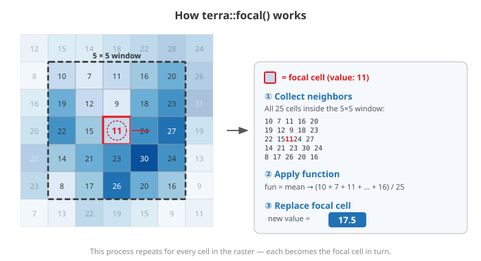
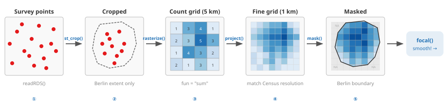

```{r}
#| include: false
library(dplyr)
library(sf)
library(terra)
library(tmap)
```

## Now

```{r}
#| echo: false
source("_ignore/sessions/course_content.R") 

course_content |> 
  kableExtra::row_spec(5, background = "yellow")
```

## Our plan

Thus far, we have learned about

- Different data formats
- How to load them
- First steps in interacting with them

In this session, you will learn

- How to wrangle raster data even further
- Linking to vector data
- Manipulating the raster values
- How to convert from one format into the other

## Quick reminder: Census data documentation

We'll continue using Census 2022 rasters from `./data/z22/` throughout this session. If you're unsure what a variable represents:

- **In R**: `z22::z22_features()` lists all features; `z22::z22_categories()` decodes `.nc` layer names
- **Online**: [Census 2022 database](https://ergebnisse.zensus2022.de/datenbank/online/themes)

The data were downloaded with the [`z22` package](https://cran.r-project.org/package=z22) — see `R/download_z22.R` in the course repo for the exact script.

## Subsetting {.center style="text-align: center;"}

## Cropping raster data

Cropping is a method of cutting out a specific 'slice' of a raster layer based on an input dataset or geospatial extent, such as a bounding box. We often do this to 'zoom' in on a dataset or to make our computations more efficient. 

::: {.fragment}
{width="60%" fig-align="center"}
:::

::: {.fragment}
Let's pretend we are mainly interested in the small-scale population size of Eastern Germany. For this purpose, we can use the bounding box of Eastern Germany.
:::

## Bounding box in `R`

The easiest way (in my opinion) to create a bounding box in `R` is to use the `sf::st_bbox()` function, possibly based on another geospatial dataset.

```{r}
#| output-location: fragment
bbox_east <-
  sf::st_read("./data/boundaries/VG250_LAN.shp", quiet = TRUE) |>
  dplyr::filter(SN_L %in% 11:16, GF == 4) |> # Eastern states
  sf::st_transform(3035) |> # reproject
  sf::st_bbox() |> # bounding box
  sf::st_as_sfc(crs = 3035) # as geometry

bbox_east
```

## Cropping the Census data on population numbers

Now, cropping is easy using the `terra::crop()` function.

```{r}
#| output-location: fragment
pop_grid_2022 <- terra::rast("./data/z22/population.tif")

pop_grid_2022_crop <- terra::crop(pop_grid_2022, bbox_east) # crop to bbox

terra::ext(pop_grid_2022) # full extent
```

::: {.fragment}
```{r}
#| output-location: fragment
terra::ext(pop_grid_2022_crop) # cropped extent
```
:::

::: {.fragment}
Note the different spatial extents.
:::

## Plotting the different extents

:::: columns
::: {.column width="50%"}
```{r}
#| fig.asp: .8
#| output-location: fragment
terra::plot(pop_grid_2022)
```
:::

::: {.column width="50%"}
```{r}
#| fig.asp: .8
#| output-location: fragment
terra::plot(pop_grid_2022_crop)
```
:::
::::

## Wait a minute...

...do these data only include Eastern German states? Let's have a look at their shapes.

```{r}
#| echo: false
#| message: false
#| warning: false
#| output-location: column-fragment
#| fig-asp: .8
east_german_states <-
  sf::st_read(
    "./data/boundaries/VG250_LAN.shp",
    quiet = TRUE
  ) |>
  sf::st_transform(3035) |> 
  dplyr::filter(SN_L %in% 11:16, GF == 4) # subset 

plot(pop_grid_2022_crop) # raster base layer
plot(
  sf::st_geometry(east_german_states),
  border = "black",
  col = scales::alpha("white", .2),
  lwd = 4,
  add = TRUE # overlay borders
)
```

## First solution: `terra::mask()`

Masking is similar to cropping, yet values outside the masking geometry (rather than outside the extent) are set to missing values (`NA`) — the raster extent itself stays unchanged.

::: {.fragment}
{width="60%" fig-align="center"}
:::

::: {.fragment}
::: {.callout-note}
Raster data often contain `NA` cells (e.g., water bodies, areas outside borders). Most functions require `na.rm = TRUE` to handle them — you'll see this argument throughout this session. Keep it in mind whenever you work with raster data!
:::
:::

## First solution: `terra::mask()`

```{r}
#| echo: true
#| output-location: column-fragment
#| fig.asp: .8
pop_grid_2022_mask <-
  terra::mask(
    pop_grid_2022,
    terra::vect(east_german_states) # mask boundary
  )

plot(pop_grid_2022_mask)
```


## Second and best solution: combining masking and cropping

```{r}
#| echo: true
#| output-location: column-fragment
#| fig.asp: .8
pop_grid_2022_crop <-
  terra::mask(
    pop_grid_2022,
    terra::vect(east_german_states) # mask boundary
  ) |>
  terra::crop(east_german_states) # trim extent

plot(pop_grid_2022_crop)
```

## Exercise 3_1: Subsetting Raster Data {.center style="text-align: center;"}

[🖱 Click here to open the exercise](https://denabel.github.io/advanced_geospatial_26/exercises/3_1_Subsetting_Raster_Data.html)

{width="15%" fig-align="center"}

*AI-assisted picture*

## Extraction & Aggregation {.center style="text-align: center;"}

## Changes in terminology

If we only want to add one attribute from a vector dataset `Y` to another vector dataset `X`, we can conduct a spatial join using `sf::st_join()` as shown earlier. In the raster data world, these operations are called **raster extractions**:

- Apply calculations that are the same for all geometries in the dataset
- **Extract information from the raster fast and efficiently**

::: {.fragment}
{width="70%" fig-align="center"}
:::

## Pulling in some data

For this effort, we re-import the synthetic survey geocoordinates. We sample 100 geocoordinates from the whole dataset, as we only need a few to demonstrate the procedures that are followed.

```{r}
#| echo: true
#| output-location: column-fragment
points <-
  readRDS(
    "./data/survey/synthetic_survey_geocoordinates.rds"
  ) |>
  dplyr::sample_n(size = 100) # random subset

points
```

## Raster extraction

We use the following to extract the raster values at a specific point by location.

```{r}
#| output-location: fragment
terra::extract(pop_grid_2022, points, ID = FALSE) |> # extract at point locations
  head(10)
```

::: {.fragment}
::: {.callout-warning}
Make sure your raster and vector data share the same CRS before extracting — `terra::extract()` will not always warn you if they don't, and results may be silently wrong!
:::
:::

## Add results to existing dataset

This information can be added to an existing dataset (our points in this example).

```{r}
#| output-location: fragment
points$pop <- # add as new column
  terra::extract(pop_grid_2022, points, ID = FALSE)[[1]]

points
```

## More elaborate: spatial buffers

Sometimes, extracting information 1:1 is not enough.

- It's too narrow
- There is missing information about the surroundings of a point

::: {.fragment}
{width="80%" fig-align="center"}
:::

## Buffer extraction

We can use spatial buffers of different sizes to extract information about our surroundings.

:::: columns
::: {.column width="50%"}
```{r}
#| code-line-numbers: "3"
#| output-location: fragment
terra::extract(
  pop_grid_2022,
  sf::st_buffer(points, 2500), # 2.5km buffer
  fun = mean,
  na.rm = TRUE,
  ID = FALSE,
  raw = TRUE
) |>
  head(10)
```
:::

::: {.column width="50%"}
```{r}
#| code-line-numbers: "3"
#| output-location: fragment
terra::extract(
  pop_grid_2022,
  sf::st_buffer(points, 5000), # 5km buffer
  fun = mean,
  na.rm = TRUE,
  ID = FALSE,
  raw = TRUE
) |>
  head(10)
```
:::
::::

## Extraction toggles: `touches`

There's a multitude of arguments that we can adjust to conduct the extraction. An important option is from which raster cells we want our extraction done. Here's an example of how the argument `terra::extract(..., touches = FALSE/TRUE)` works.

::: {.frame}
{width="80%" fig-align="center"}
:::

## `touches = FALSE` vs. `touches = TRUE`

Let's see how the values differ when we apply the option or not.

:::: columns
::: {.column width="50%"}
```{r}
#| code-line-numbers: "6"
#| output-location: fragment
terra::extract(
  pop_grid_2022,
  sf::st_buffer(points, 2500),
  fun = mean,
  na.rm = TRUE,
  touches = FALSE, # strict: cells inside only
  ID = FALSE,
  raw = TRUE
) |>
  head(10)
```
:::

::: {.column width="50%"}
```{r}
#| code-line-numbers: "6"
#| output-location: fragment
terra::extract(
  pop_grid_2022,
  sf::st_buffer(points, 2500),
  fun = mean,
  na.rm = TRUE,
  touches = TRUE, # also touching cells
  ID = FALSE,
  raw = TRUE
) |>
  head(10)
```
:::
::::

## Extraction function

Often, we default to the mean of raster cell values to be extracted. In our example, calculating the sum is more relevant as we deal with population counts. Or the maximum?

:::: columns
::: {.column width="50%"}
```{r}
#| code-line-numbers: "4"
#| output-location: fragment
terra::extract(
  pop_grid_2022,
  sf::st_buffer(points, 2500),
  fun = sum, # total population
  na.rm = TRUE,
  touches = FALSE,
  ID = FALSE,
  raw = TRUE
) |>
  head(10)
```
:::

::: {.column width="50%"}
```{r}
#| code-line-numbers: "4"
#| output-location: fragment
terra::extract(
  pop_grid_2022,
  sf::st_buffer(points, 2500),
  fun = max, # peak population
  na.rm = TRUE,
  touches = TRUE,
  ID = FALSE,
  raw = TRUE
) |>
  head(10)
```
:::
::::

## Custom functions

We can even define custom functions.

```{r}
#| output-location: fragment
#| code-line-numbers: "4"
terra::extract(
  pop_grid_2022,
  sf::st_buffer(points, 2500),
  fun = function (x) {max(x, na.rm = TRUE) / sum(x, na.rm = TRUE)}, # max/sum ratio
  touches = FALSE,
  ID = FALSE,
  raw = TRUE
) |>
  head(10)
```

## Raster aggregation

We can use the same procedure to aggregate a raster dataset into a vector polygon dataset. That's a widespread use case. Let's load our German districts vector dataset in `./data/boundaries/`. This time, we will use WorldPop raster data on gender ratios from 2020.

```{r}
#| echo: true
#| output-location: column-fragment
#| fig.asp: .7
german_districts <-
  sf::st_read(
    "./data/boundaries/VG250_KRS.shp",
    quiet = TRUE
  ) |>
  sf::st_transform(3035) # match raster CRS

gender_ratios_2020 <-
  terra::rast("./data/worldpop/gender_ratio_2020.tif")

plot(gender_ratios_2020) # raster base layer
plot(
  sf::st_geometry(german_districts),
  border = "white", col = NA,
  lwd = .5, add = TRUE # overlay districts
)
```

## Adding the aggregated data

Again, we use `terra::extract()` to create the aggregated data, which we can add to our vector dataset.

```{r}
#| echo: true
#| output-location: column-fragment
#| fig.asp: .8
german_districts$gender_ratios_2020 <-
  terra::extract(
    gender_ratios_2020,
    german_districts, # aggregate into polygons
    fun = mean,
    na.rm = TRUE,
    ID = FALSE
  ) |>
  unlist() # extract returns df → vector

plot(german_districts["gender_ratios_2020"])
```

## Spatial smoothing {.center style="text-align: center;"}

## Why smooth raster data?

Raw raster values can be noisy — individual cells may fluctuate due to small sample sizes, measurement error, or natural variability. This makes it hard to see **spatial patterns**.

::: {.fragment}
::: {.smaller-text}
Smoothing helps us to:

- **Reveal hidden spatial structure** in noisy data (e.g., rent clusters, population hotspots)
- **Create heat maps** for visualization and exploratory analysis
- **Pre-process data** before linking them to other datasets (e.g., survey points)
:::
:::

::: {.fragment}
{width="60%" fig-align="center"}
:::

## The problem: raw data are noisy

Let's zoom into Berlin and look at average rent prices from the Census. We subset, mask, and crop — techniques we already know.

```{r}
#| echo: true
#| output-location: column-fragment
#| fig.asp: .7
berlin <-
  german_districts |>
  dplyr::filter(AGS == "11000") # Berlin district

rent_berlin <-
  terra::rast("./data/z22/rent_avg.tif") |>
  terra::mask(berlin) |> # clip to Berlin
  terra::crop(berlin) # trim extent

plot(rent_berlin)
```

::: {.fragment}
Can you see spatial clusters? It's possible, but the cell-to-cell variation makes it hard to tell. **This is where smoothing comes in.**
:::

## How `terra::focal()` works

The idea is simple: replace each cell's value with a **summary of its neighbors**. A moving window slides across the entire raster — for each position, it collects the values inside the window and applies a function (e.g., `mean`).

{.r-stretch fig-align="center"}

## It's just a simple base `R` matrix

The `w` argument defines the window. When using this matrix and `fun = mean`, we replace each cell with the mean of itself and its 24 neighbors.

```{r}
#| output-location: fragment
matrix(1, 5, 5)
```

::: {.fragment}
But we can change that however we want:

```{r}
#| output-location: fragment
weighted_w <- matrix(c(rep(.5, 12), 1, rep(.5, 12)), 5, 5) # center weighted

weighted_w
```
:::

## Window size matters

Now let's apply `focal()` to our rent data. The choice of window size is a trade-off: **larger windows** produce smoother surfaces but lose local detail.

```{r}
#| include: false
# needed later for project() target
rent_berlin_smooth <- terra::focal(rent_berlin, w = matrix(1, 5, 5), fun = mean, na.rm = TRUE)
```

:::: columns
::: {.column width="33%"}
```{r}
#| fig.asp: .9
#| output-location: fragment
terra::focal(
  rent_berlin,
  w = matrix(1, 3, 3),
  fun = mean,
  na.rm = TRUE
) |>
  plot(main = "3×3")
```
:::

::: {.column width="33%"}
```{r}
#| fig.asp: .9
#| output-location: fragment
terra::focal(
  rent_berlin,
  w = matrix(1, 5, 5),
  fun = mean,
  na.rm = TRUE
) |>
  plot(main = "5×5")
```
:::

::: {.column width="33%"}
```{r}
#| fig.asp: .9
#| output-location: fragment
terra::focal(
  rent_berlin,
  w = matrix(1, 9, 9),
  fun = mean,
  na.rm = TRUE
) |>
  plot(main = "9×9")
```
:::
::::

::: {.fragment}
Compare the 3×3 with the raw plot on the previous slide — the spatial structure (high rents in the west, lower in the east) becomes much clearer even with minimal smoothing.
:::

## From survey points to a density surface {.center style="text-align: center;"}

## What if we don't have a grid?

So far, we smoothed existing Census grid data. But what if we only have **point observations**, e.g., from a survey? We can create a density surface from scratch using `terra::rasterize()`.

::: {.fragment}
::: {.callout-note}
Usually, when we talk about heat maps, we mean analyzing point patterns and whether they spatially cluster. `terra` might not be your best choice regarding more elaborate techniques to estimate density kernels and distance-based bandwidths between points to draw clusters. For this purpose, packages such as `spatstat` are better suited but require [learning about other data structures](https://r-spatial.org/book/11-PointPattern.html). That said, densities are more advanced ways of counting things in raster grid cells, and we can mimic this behavior also with `terra`. So, let's stick to this package and crop all of our points to the extent of Berlin.
:::
:::

## The pipeline: points → grid → smooth

{width="95%" fig-align="center"}

::: {.fragment}
```{r}
#| echo: true
#| output-location: column-fragment
#| fig.asp: .5
points_berlin <-
  readRDS(
    "./data/survey/synthetic_survey_geocoordinates.rds"
  ) |>
  sf::st_crop(berlin) # Step 1: crop to Berlin

plot(sf::st_geometry(points_berlin))
```
:::

## Create template and rasterize

Our points are sparse — 1 km² cells would be mostly empty. So we count on a coarse 5 km grid first, then refine.

```{r}
#| echo: true
#| output-location: column-fragment
#| fig.asp: .8
raster_template <-
  points_berlin |>
  sf::st_bbox() |> terra::ext() |>  # extent of points
  terra::rast(resolution = 5000, crs = "EPSG:3035") # 5km grid

points_berlin_density <-
  terra::rasterize(
    points_berlin,
    raster_template,   # target grid
    fun = "sum",       # count per cell
    background = 0     # empty cells = 0
  )

plot(points_berlin_density)
```

## Step 4: Reproject and mask

This doesn't look great yet. But we can reproject our 5 km grid onto a 1 km grid (matching the Census resolution) and mask to the Berlin border.

```{r}
#| echo: true
#| output-location: column-fragment
#| fig.asp: .55
points_berlin_density <-
  points_berlin_density |>
  terra::project(rent_berlin) |> # match 1km grid
  terra::mask(rent_berlin) # clip to Berlin

plot(points_berlin_density)
```

## Step 5: Smooth — and compare to Census data

Now we apply `focal()` to both our survey density and the Census rent data:

:::: columns
::: {.column width="50%"}
```{r}
#| fig.asp: .6
#| output-location: fragment
terra::focal(
  rent_berlin,
  w = matrix(1, 5, 5),
  fun = mean,
  na.rm = TRUE
) |>
  plot(main = "Census rent (5×5)")
```
:::

::: {.column width="50%"}
```{r}
#| fig.asp: .6
#| output-location: fragment
focal(
  points_berlin_density,
  w = matrix(1, 5, 5),
  fun = mean,
  na.rm = TRUE
) |>
  plot(main = "Survey density (5×5)")
```
:::
::::

## Taking a step back

The Census grid (left) captures fine-grained variation because it covers the **entire population**. Our survey density (right) is driven by a **sparse sample** — the patterns look very different.

::: {.fragment}
**Keep in mind:**

- Survey-based density surfaces are great for **exploratory visualization**, but they are **not a substitute** for high-resolution administrative data
- Window size is a critical choice: too small → noise; too large → you blur away the signal

::: {.callout-tip}
Always consider your **data source and sample size** before interpreting smoothed surfaces.
:::
:::

## New functions at a glance 🧰 (1/3)

**Subsetting**

| Function | What it does |
|---|---|
| `terra::crop(raster, extent)` | Cut raster to bounding box / extent |
| `terra::mask(raster, polygon)` | Set cells outside polygon to `NA` |
| `terra::ext()` | Inspect or compare spatial extents |
| `sf::st_bbox() |> sf::st_as_sfc()` | Create a bounding-box geometry |

## New functions at a glance 🧰 (2/3)

**Extraction & Aggregation**

| Function | What it does |
|---|---|
| `terra::extract(raster, points)` | Get raster values at point locations |
| `sf::st_buffer(points, dist)` | Create circular buffers around points |
| `terra::extract(..., fun = mean)` | Summarize buffer zones or polygons (mean, sum, …) |

## New functions at a glance 🧰 (3/3)

**Rasterize & Smooth**

| Function | What it does |
|---|---|
| `terra::rasterize(points, grid, fun)` | Count / summarize points per cell |
| `terra::project(raster, target)` | Reproject or resample to another grid |
| `terra::focal(raster, w, fun)` | Moving-window smoothing / filter |
| `w = matrix(1, n, n)` | Define an n × n focal window |
| `sf::st_crop(points, polygon)` | Subset points to a study area |

## Exercise 3_2: Extracting and Analyzing Raster Information {.center style="text-align: center;"}

[🖱 Click here to open the exercise](https://denabel.github.io/advanced_geospatial_26/exercises/3_2_Extracting_Analyzing_Raster_Information.html)

{width="15%" fig-align="center"}

*AI-assisted picture*

## Appendix {.center style="text-align: center;"}

## Real life example: Detecting spatial boundaries {.center}

Edge detection algorithms from image processing can be applied to raster data to identify sudden spatial changes. For instance, Legewie & Schaeffer (2016) used this technique to study ethnic neighborhood boundaries. We can apply the same idea to detect rent price boundaries — areas where average rents change abruptly, which may indicate gentrification fronts or distinct housing submarkets.

{.r-stretch fig-align="center"}

##  What is edge detection?

Edge detection identifies sudden color changes in an image to 'draw' borders of things in a picture. Here's an example of the prominent Sobel filter.

:::: columns
::: {.column width="50%"}
{fig-align="center" width="75%"}
:::

::: {.column width="50%"}
{fig-align="center" width="75%"}
:::
::::

<small>Source: [Wikipedia — Sobel operator](https://en.wikipedia.org/wiki/Sobel_operator)</small>

## We can do that as well using a Sobel filter

`R` is good for math, right? While this is the formula for applying the Sobel filter to a raster image...

$$r_x = \begin{bmatrix}1 & 0 & -1 \\2 & 0 & -2 \\1 & 0 & -1\end{bmatrix} \times raster\_file \\r_y = \begin{bmatrix}1 & 2 & 1 \\0 & 0 & 0 \\-1 & -2 & -1\end{bmatrix}\times raster\_file \\r_{xy} = \sqrt{r_{x}^2 + r_{y}^2}$$


## Implementation in R

...we can easily translate it to be used in `terra::focal()`^[http://search.r-project.org/R/library/terra/html/focal.html].

```{r}
sobel <- function(r) {
  fy <- matrix(c(1, 0, -1, 2, 0, -2, 1, 0, -1), nrow = 3) # vertical kernel
  fx <- matrix(c(-1, -2, -1, 0, 0, 0, 1, 2, 1) , nrow = 3) # horizontal kernel (sign-flipped vs. formula — doesn't matter since we square it)
  rx <- terra::focal(r, fx) # horizontal gradient
  ry <- terra::focal(r, fy) # vertical gradient
  sqrt(rx^2 + ry^2) # gradient magnitude
}

rent_berlin_edges <- sobel(rent_berlin_smooth) # apply to smoothed rents
```

## Comparison

We can now clearly display the edges of sudden changes in rent levels within Berlin.

:::: columns
::: {.column width="50%"}
```{r}
#| fig.asp: .6
#| output-location: fragment
plot(rent_berlin_smooth)
```
:::

::: {.column width="50%"}
```{r}
#| fig.asp: .6
#| output-location: fragment
plot(rent_berlin_edges)
```
:::
::::

## Conversion {.center style="text-align: center;"}

## Why convert?

Sometimes we need to switch between raster and vector representations:

- **Raster → Points**: When you need to treat grid cells as individual observations for statistical analysis
- **Points → Raster**: When you want to create a continuous surface from point measurements
- **Raster → Polygons**: When you need to join raster information into a vector-based workflow (e.g., for spatial joins with `sf`)

All conversions are straightforward with `terra`.

## Raster to points

```{r}
#| echo: true
#| output-location: column-fragment
#| fig.asp: 1
raster_now_points <-
  rent_berlin |>
  terra::as.points() # each cell → point

plot(raster_now_points)
```

## Points to raster

```{r}
#| echo: true
#| output-location: column-fragment
#| fig.asp: 1
raster_target_layer <-
  terra::ext(raster_now_points) |>
  terra::rast(res = 1000) # empty 1km target grid

points_now_raster <-
  raster_now_points |>
  terra::rasterize(
    raster_target_layer,
    field = "cat_0", # value column
    fun = "mean",
    background = 0
  )

plot(points_now_raster)
```

## Raster to polygons

```{r}
#| echo: true
#| output-location: column-fragment
#| fig.asp: 1
polygon_raster <-
  rent_berlin |>
  terra::as.polygons() |> # each cell → polygon
  sf::st_as_sf() # convert to sf

plot(polygon_raster)
```
