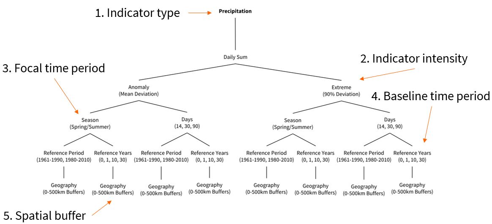

```{r}
#| include: false
library(dplyr)
library(sf)
library(terra)
library(tmap)
library(keyring)
library(rnaturalearth)
library(tidyverse)
```

## Now

```{r}
#| echo: false
source("_ignore/sessions/course_content.R") 

course_content |> 
  kableExtra::row_spec(12, background = "yellow")
```

## Our plan

So far, we have learned how to

- Load, inspect, and subset raster data
- Extract and aggregate raster values to points and polygons
- Work with raster stacks and data cubes


::: {.fragment}
In this session, we put it all together in a **real research workflow**:

- Introduce a social science survey dataset (ISSP)
- Access Earth observation data via an API (Copernicus ERA5)
- Aggregate gridded climate data to the country level
- Link survey and EO data to investigate: **Do temperature anomalies relate to climate concern?**
:::

## Survey data: ISSP Environment (1993-2020)

After downloading the ISSP data file from the website, we placed it in our `./data` folder. We have already prepared a script in the folder `./R` called `prep_issp.R` to prepare the data, which we call using `source()`. 

```{r}
#| output-location: fragment
source("./R/prep_issp.R")

head(issp, 10)
```

## Climate concern in 2020

:::: columns
::: {.column width="40%"}
There's a nice item in the ISSP where respondents could evaluate whether 

> "A rise in world's temperature is (dangerous/ not dangerous) for environment"^[https://access.gesis.org/dbk/77274]

:::

::: {.column width="60%"}
```{r}
#| echo: false
#| fig.asp: .8
likert_plot_2020
```
:::
::::

## The research design

Our question: **Are people in countries that experienced unusual warming more concerned about climate change?**

Why *anomalies* instead of absolute temperatures? A hot country isn't automatically more concerned — but a country that is *unusually* hot compared to its own history might be. The anomaly captures the deviation from "normal".

::: {.fragment}
::: {.smaller-text}
Here's the workflow we'll follow:

1. **Survey data** (ISSP) → climate concern per country & year
2. **EO data** (ERA5) → annual mean temperature per country & year (focal: 1993, 2000, 2010, 2020)
3. **Baseline** (1961–1990) → long-term "normal" temperature per country
4. **Anomaly** = focal year temperature − baseline
5. **Join & compare** — do anomalies track with concern?
:::
:::

## ERA5 data

The ERA5-Land Reanalysis from the Copernicus Climate Change Service is a suitable data product for this temperature indicator. It records observations on air temperature at 2 meters above the surface from 1950 onwards, has a spatial resolution of 0.1x0.1 degrees, and has global spatial coverage. We can apply our conceptualization exactly to these data.

{.r-stretch fig-align="center"}

## Data access: Copernicus ERA5

To access ERA5 data, we use the `ecmwfr` package with a Copernicus API key. Since the ISSP covers countries across all continents, we download at global extent.

```{r}
#| eval: false
# Store API key (one-time setup)
keyring::key_set_with_value(service = "wf_api_key", password = "MY-API-KEY")
```

::: {.callout-note}
## 📦 Data already included
The ERA5 files are pre-downloaded in `./data/era5/`. The following slides show how we obtained them so you understand the workflow — **you don't need to run this code yourself**.
:::

## Country-level polygons

We load world country polygons — these are our spatial units for aggregating the gridded temperature data.

```{r}
#| echo: true
#| output-location: column-fragment
#| fig.asp: .8
world <-
  rnaturalearth::ne_countries(
    scale = "medium",
    returnclass = "sf"
  ) |>
  dplyr::select(
    admin,
    iso_a3,
    geometry
  )

plot(sf::st_geometry(world))
```

## Downloading the data

::: {.smaller-text}
```{r}
#| eval: false
# API access looped over four years
for (yr in c("1993", "2000", "2010", "2020")) {
  
  # Create file names which include year
  file_name <- paste0("era5_temperature", yr, ".grib")
  
  # Specify API request
  request <- 
    list(
      data_format = "grib",
      variable = "2m_temperature",
      product_type = "monthly_averaged_reanalysis",
      time = "00:00",
      year = yr,
      month = 
        c(
          "01", "02", "03", "04", "05", "06", "07", "08", "09", "10", "11", "12"
        ),
      area = c(90, -180, -90, 180),
      dataset_short_name = "reanalysis-era5-land-monthly-means",
      target = file_name
    )
  
  # Download data from C3S
  file_path <- 
    ecmwfr::wf_request(
      request = request,
      transfer = TRUE,
      path = "./data/era5",
      verbose = FALSE
    )
}
```
:::

## Importing and inspecting the data

Each file contains 12 monthly layers for one year. Let's load all four focal years and inspect the 2020 cube.

```{r}
temp_1993 <- terra::rast("./data/era5/era5_temperature1993.grib")
temp_2000 <- terra::rast("./data/era5/era5_temperature2000.grib")
temp_2010 <- terra::rast("./data/era5/era5_temperature2010.grib")
temp_2020 <- terra::rast("./data/era5/era5_temperature2020.grib") 
```

:::: columns
::: {.column width="50%"}
```{r}
#| output-location: fragment
temp_2020
```
:::

::: {.column width="50%"}
```{r}
#| output-location: fragment
#| fig.asp: .7
plot(temp_2020[[1]]) # January 2020
```
:::
::::

## Aggregating to the country level

Now, we can aggregate the monthly values by year and country. If necessary, we will check that our country polygons and the raster files have the same CRS and align.

::: {.smaller-text}
```{r}
#| message: false
#| warning: false
for (yr in c("1993", "2000", "2010", "2020")) {
  temp_data <- get(paste0("temp_", yr))
  
  # Check CRS of both datasets and adjust if necessary
  if (!identical(terra::crs(world), terra::crs(temp_data))) {
    world <- 
      world |>
      sf::st_transform(sf::st_crs(temp_data))
  }
  
  # Collapse the month layers into one layer by averaging across months
  annual_values <- terra::app(temp_data, fun = mean, na.rm = TRUE, cores = 4)
  
  # Aggregate by country
  country_values <- 
    terra::extract(
      annual_values,
      world,
      fun = mean,
      na.rm = TRUE
    )
  
  # Add values to shapefile
  world[paste0("temp_", yr)] <- country_values[, 2]
}
```
:::

## The result

We now have our country polygon vector file with yearly mean temperatures for each survey year.

```{r}
#| output-location: fragment
head(world, 2)
```

::: {.fragment}
```{r}
#| fig.asp: .3
#| output-location: column-fragment
plot(world["temp_2020"])
```
:::

## Baseline: same workflow for 1961–1990

We repeat the exact same process for the baseline period. The download code is analogous (see Appendix) — here we import and aggregate directly.

```{r}
temp_base <- terra::rast("./data/era5/era5_temperature1961-1990.grib")
```

```{r}
#| echo: false
if(!identical(terra::crs(world), terra::crs(temp_base))) {
  world <- world |> sf::st_transform(crs = sf::st_crs(temp_base))
}
annual_values_base <- readRDS("./data/era5/annual_values_base.rds")
country_values <- terra::extract(annual_values_base, world, fun = mean, na.rm = TRUE)
world$temp_base <- country_values[, 2]
```

```{r}
#| eval: false
# Same pattern: app() to collapse months/years → extract() by country
annual_values <- terra::app(temp_base, fun = mean, na.rm = TRUE, cores = 4)
world$temp_base <- terra::extract(annual_values, world, fun = mean, na.rm = TRUE)[, 2]
```

::: {.fragment}
```{r}
#| output-location: fragment
head(world)
```
:::

## Calculating deviations

Now that we have the focal and baseline values, we calculate single deviations.

```{r}
#| echo: true
#| output-location: column-fragment
#| fig.asp: .8
world <-
  world |>
  dplyr::mutate(
    diff_1993 = temp_1993 - temp_base,
    diff_2000 = temp_2000 - temp_base,
    diff_2010 = temp_2010 - temp_base,
    diff_2020 = temp_2020 - temp_base
  )

# Plot 2020 deviation from baseline
ggplot(data = world) +
  geom_sf(aes(fill = diff_2020)) +
  scale_fill_viridis_c() +
  theme_minimal() +
  labs(
    title =
      "Deviation of 2020 temperature from baseline",
    subtitle = "Averaged across countries",
    fill = "Temperature (K)"
  )
```

## Restructuring the temperature data

First, we reshape the temperature anomalies into long format — one row per country and year, keeping the raw values in Kelvin.

```{r}
#| echo: true
#| output-location: column-fragment
world_restructured <-
  world |>
  sf::st_drop_geometry() |>
  dplyr::select(
    country = admin,
    dplyr::contains("diff_")
  ) |>
  tidyr::pivot_longer(
    cols = dplyr::contains("diff_"),
    values_to = "temp_diff",
    names_to = "diff"
  ) |>
  dplyr::mutate(
    year = as.numeric(stringr::str_extract(diff, "\\d{4}"))
  )

world_restructured
```

## Linking at the individual level

Remember `terra::extract()` from Session 3? We used it to link raster values to points and polygons. That's exactly what we did earlier — aggregating gridded temperatures to country polygons. Now we join the anomalies directly to **every individual respondent** via country name and year. This is the core pattern: **spatial aggregation** (raster → polygons) followed by a **tabular join** (via `dplyr::left_join()`).

```{r}
#| echo: true
#| output-location: column-fragment
issp_linked <-
  issp |>
  dplyr::mutate(
    country = ifelse(
      country == "USA",
      "United States of America",
      country
    )
  ) |>
  dplyr::left_join(
    world_restructured,
    by = c("country", "year")
  )

issp_linked
```

## Individual-level view: The full picture

We group countries by the size of their temperature anomaly — **cooler than baseline** (≤ 0 K), **slightly warmer** (0–1 K), or **clearly warmer** (> 1 K) — and show how individual concern responses (1–5) are distributed within each group. This is the raw data before any aggregation.

```{r}
#| echo: false
#| fig.asp: .7
#| fig-align: center
issp_linked |>
  dplyr::filter(!is.na(concern), !is.na(temp_diff)) |>
  dplyr::mutate(
    warming = cut(
      temp_diff,
      breaks = c(-Inf, 0, 1, Inf),
      labels = c("≤ 0 K", "0–1 K", "> 1 K")
    ),
    concern = factor(concern, labels = c("1 (low)", "2", "3", "4", "5 (high)"))
  ) |>
  dplyr::count(year, warming, concern) |>
  dplyr::group_by(year, warming) |>
  dplyr::mutate(prop = n / sum(n)) |>
  ggplot(aes(x = warming, y = concern, fill = prop)) +
  geom_tile(color = "white", linewidth = .5) +
  geom_text(aes(label = scales::percent(prop, accuracy = 1),
                color = prop > .20),
            size = 3, show.legend = FALSE) +
  scale_color_manual(values = c("TRUE" = "white", "FALSE" = "black")) +
  facet_wrap(~year, nrow = 1) +
  scale_fill_viridis_c(labels = scales::percent, option = "inferno", direction = -1) +
  labs(
    x = "Temperature anomaly group",
    y = "Climate concern",
    fill = "Share"
  ) +
  theme_minimal() +
  theme(legend.position = "bottom", panel.grid = element_blank())
```

## Now let's aggregate — what changes?

We deliberately move from individuals to country means — using the **same anomaly groups** as above. Compare the full concern distributions in the heatmap with these boxplots: the individual variation collapses into a narrow band of country means.

```{r}
#| echo: false
#| fig.asp: .6
#| fig-align: center
issp_country <-
  issp_linked |>
  dplyr::filter(!is.na(concern), !is.na(temp_diff)) |>
  dplyr::mutate(
    warming = cut(
      temp_diff,
      breaks = c(-Inf, 0, 1, Inf),
      labels = c("≤ 0 K", "0–1 K", "> 1 K")
    )
  ) |>
  dplyr::group_by(country, year, warming, temp_diff) |>
  dplyr::summarize(
    concern = mean(concern, na.rm = TRUE),
    .groups = "drop"
  )

ggplot(issp_country, aes(x = warming, y = concern)) +
  geom_boxplot(outlier.shape = NA, fill = "grey90") +
  geom_jitter(alpha = .5, width = .15, size = 1.5) +
  facet_wrap(~year, nrow = 1) +
  labs(
    x = "Temperature anomaly group",
    y = "Mean climate concern\n(country average, 1–5)"
  ) +
  theme_bw()
```

## Country trajectories: Who moves where?

Each line is one country traced through the survey years it participated in. The x-axis is the temperature anomaly, the y-axis is mean concern. Most countries move **rightward** (growing anomalies), but their concern trajectories diverge.

```{r}
#| echo: false
#| fig.asp: .7
#| fig-align: center
# Highlighted countries: diverse regions, trajectories, and dev. levels
highlight_countries <- c(
  "Germany", "Russia", "Japan",
  "United States of America", "Philippines", "South Africa"
)

# Short labels for the plot
country_labels <- c(
  "Germany" = "Germany", "Russia" = "Russia", "Japan" = "Japan",
  "United States of America" = "USA", "Philippines" = "Philippines",
  "South Africa" = "South Africa"
)

plot_data <- issp_country |>
  dplyr::group_by(country) |>
  dplyr::filter(dplyr::n() > 1) |>
  dplyr::ungroup() |>
  dplyr::mutate(highlight = country %in% highlight_countries)

hl_data <- plot_data |>
  dplyr::filter(highlight) |>
  dplyr::mutate(
    short = country_labels[country],
    label = ifelse(year == max(year), short, NA_character_)
  )

bg_data <- plot_data |> dplyr::filter(!highlight)

ggplot(mapping = aes(x = temp_diff, y = concern)) +
  # Background: all other countries (grey)
  geom_path(data = bg_data, aes(group = country),
            alpha = .3, linewidth = .4, color = "grey50") +
  geom_point(data = bg_data, aes(group = country),
             alpha = .3, size = 1.2, color = "grey50") +
  # Highlighted countries: colored by short name
  geom_path(data = hl_data, aes(group = country, color = short),
            linewidth = 1, alpha = .8) +
  geom_point(data = hl_data, aes(color = short), size = 2.5) +
  ggrepel::geom_text_repel(
    data = hl_data, aes(label = label, color = short),
    size = 3, fontface = "bold", max.overlaps = 20, seed = 42,
    show.legend = FALSE
  ) +
  scale_color_brewer(palette = "Dark2", guide = "none") +
  labs(
    x = "Temperature anomaly (K, vs. 1961–1990 baseline)",
    y = "Mean climate concern (1–5)"
  ) +
  theme_bw()
```

## What do we see? (1/2)

::: {.smaller-text}
**Individual-level heatmap**

- The concern distribution looks remarkably similar across all three anomaly groups — people in "clearly warmer" countries are not systematically more concerned
- Over time, the "> 1 K" group grows (more countries experience large anomalies), but the concern distribution within each group stays fairly stable
- This is the full individual variation — something we lose entirely when we aggregate

::: {.fragment}
**Aggregated boxplot**

- Country-level means compress the individual variation into a narrow band
- The boxes differ, but not necessarily as expected — the "signal" we might hope for is not there
- This finding may also make the **aggregation problem** visible: country-level means compress individual variation into a narrow band, and patterns at one level need not appear at the other — a reminder that cross-level inference (the "ecological fallacy") works in both directions
:::
:::

## What do we see? (2/2)

::: {.smaller-text}
**Country trajectories**

- Almost all countries move rightward: anomalies grow from 1993 to 2020
- But concern trajectories are idiosyncratic — some countries grow more concerned, others less
- This result may suggest that country-specific factors (media, politics, economic context) matter more than temperature alone

::: {.fragment}
**Limitations**

- Only 4 time points — too few for robust trend analysis
- No causal claim possible: many confounding factors
- Finer spatial resolution (e.g., NUTS-3 regions) would strengthen the analysis

$\rightarrow$ But as a **workflow demonstration**, this shows how survey and EO data can be integrated end-to-end using the tools we've learned in this course.
:::
:::

## Exercise 7_1: Data Integration 🏡 {.center style="text-align: center;"}

This is a **take-home exercise** — work on it after the course at your own pace!

[🖱 Click here to open the exercise](https://denabel.github.io/advanced_geospatial_26/exercises/7_1_Data_Integration.html)

{width="15%" fig-align="center"}

*AI-assisted picture*

## Appendix: Plot code {.appendix .smaller}

The following code produces the three analysis plots shown earlier. It is provided as a reference — you don't need to type it during the session.

## Individual-level heatmap

```{r}
#| eval: false
issp_linked |>
  dplyr::filter(!is.na(concern), !is.na(temp_diff)) |>
  dplyr::mutate(
    warming = cut(
      temp_diff,
      breaks = c(-Inf, 0, 1, Inf),
      labels = c("≤ 0 K", "0–1 K", "> 1 K")
    ),
    concern = factor(concern, labels = c("1 (low)", "2", "3", "4", "5 (high)"))
  ) |>
  dplyr::count(year, warming, concern) |>
  dplyr::group_by(year, warming) |>
  dplyr::mutate(prop = n / sum(n)) |>
  ggplot(aes(x = warming, y = concern, fill = prop)) +
  geom_tile(color = "white", linewidth = .5) +
  geom_text(aes(label = scales::percent(prop, accuracy = 1),
                color = prop > .20),
            size = 3, show.legend = FALSE) +
  scale_color_manual(values = c("TRUE" = "white", "FALSE" = "black")) +
  facet_wrap(~year, nrow = 1) +
  scale_fill_viridis_c(labels = scales::percent, option = "inferno", direction = -1) +
  labs(x = "Temperature anomaly group", y = "Climate concern", fill = "Share") +
  theme_minimal() +
  theme(legend.position = "bottom", panel.grid = element_blank())
```

## Aggregated boxplot

```{r}
#| eval: false
issp_country <-
  issp_linked |>
  dplyr::filter(!is.na(concern), !is.na(temp_diff)) |>
  dplyr::mutate(
    warming = cut(
      temp_diff,
      breaks = c(-Inf, 0, 1, Inf),
      labels = c("≤ 0 K", "0–1 K", "> 1 K")
    )
  ) |>
  dplyr::group_by(country, year, warming, temp_diff) |>
  dplyr::summarize(concern = mean(concern, na.rm = TRUE), .groups = "drop")

ggplot(issp_country, aes(x = warming, y = concern)) +
  geom_boxplot(outlier.shape = NA, fill = "grey90") +
  geom_jitter(alpha = .5, width = .15, size = 1.5) +
  facet_wrap(~year, nrow = 1) +
  labs(x = "Temperature anomaly group",
       y = "Mean climate concern\n(country average, 1–5)") +
  theme_bw()
```

## Country trajectories

```{r}
#| eval: false
highlight_countries <- c(
  "Germany", "Russia", "Japan",
  "United States of America", "Philippines", "South Africa"
)

country_labels <- c(
  "Germany" = "Germany", "Russia" = "Russia", "Japan" = "Japan",
  "United States of America" = "USA", "Philippines" = "Philippines",
  "South Africa" = "South Africa"
)

plot_data <- issp_country |>
  dplyr::group_by(country) |>
  dplyr::filter(dplyr::n() > 1) |>
  dplyr::ungroup() |>
  dplyr::mutate(highlight = country %in% highlight_countries)

hl_data <- plot_data |>
  dplyr::filter(highlight) |>
  dplyr::mutate(
    short = country_labels[country],
    label = ifelse(year == max(year), short, NA_character_)
  )

bg_data <- plot_data |> dplyr::filter(!highlight)

ggplot(mapping = aes(x = temp_diff, y = concern)) +
  geom_path(data = bg_data, aes(group = country),
            alpha = .3, linewidth = .4, color = "grey50") +
  geom_point(data = bg_data, aes(group = country),
             alpha = .3, size = 1.2, color = "grey50") +
  geom_path(data = hl_data, aes(group = country, color = short),
            linewidth = 1, alpha = .8) +
  geom_point(data = hl_data, aes(color = short), size = 2.5) +
  ggrepel::geom_text_repel(
    data = hl_data, aes(label = label, color = short),
    size = 3, fontface = "bold", max.overlaps = 20, seed = 42,
    show.legend = FALSE
  ) +
  scale_color_brewer(palette = "Dark2", guide = "none") +
  labs(x = "Temperature anomaly (K, vs. 1961–1990 baseline)",
       y = "Mean climate concern (1–5)") +
  theme_bw()
```
